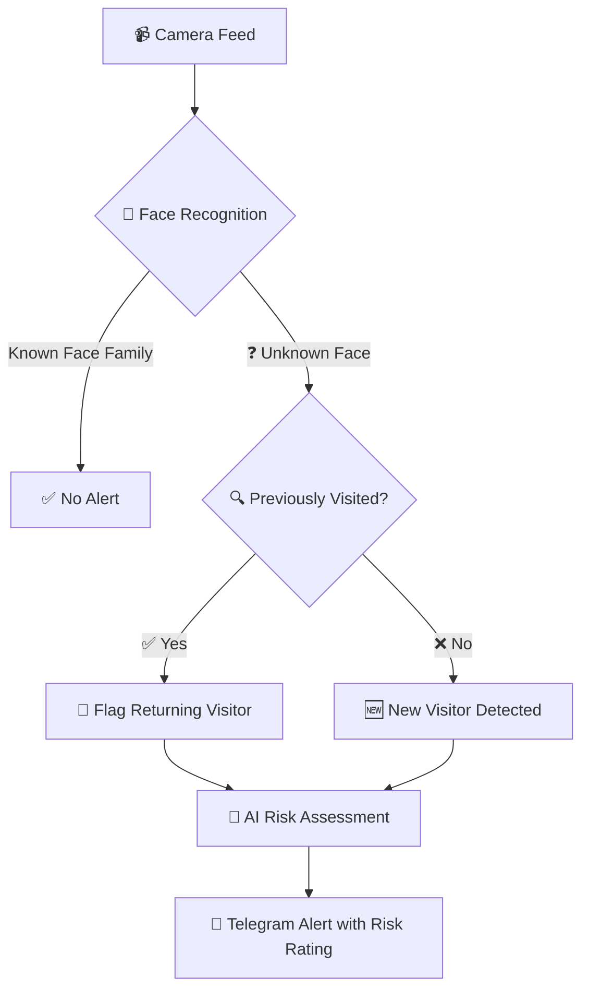
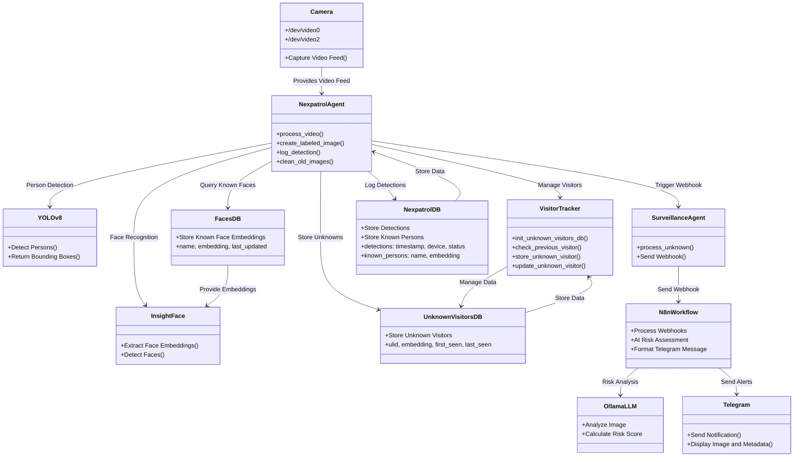
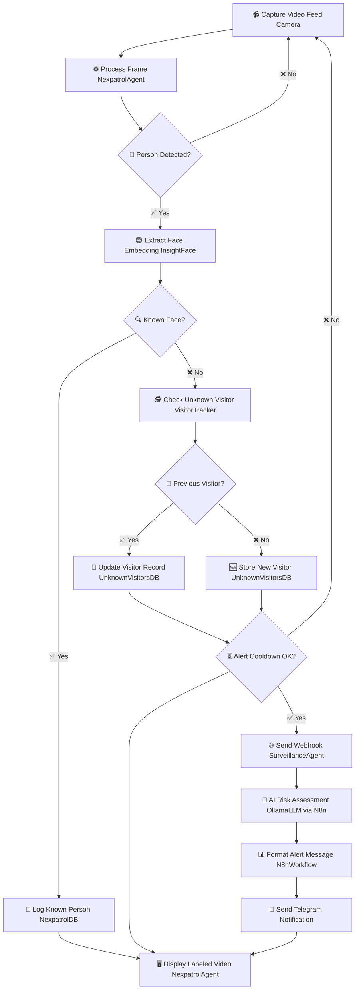

# 🏠 KinAi-Nexpatrol: AI-Powered Home Surveillance System 🤖

<div align="center">


[](https://www.docker.com/)
[](https://developer.nvidia.com/cuda-zone)
[](https://www.python.org/)
[](https://telegram.org/)

**Privacy-First | AI-Driven | GPU-Accelerated | Real-Time Alerts**

</div>

---
<!-- Row 1: Identify the Challenge -->
<table style="width: 100%; border-collapse: collapse; font-family: sans-serif;">
  <tr>
    <td style="width: 200px; text-align: center; vertical-align: top; padding: 40px;">
      
    </td>
    <td style="padding: 40px; vertical-align: top;">
      <h2 style="color: #2563eb; display: flex; align-items: center; gap: 10px; margin-top: 0;">
        <span style="font-size: 24px;">🔍</span> 1. Identify the Challenge
      </h2>
      <p>
        Traditional home security systems often flood users with constant notifications — triggered by pets, wind-blown branches, or even shifting shadows. This deluge of irrelevant alerts leads to alert fatigue, making it harder for homeowners to notice genuine threats, especially during critical hours like late at night.
      </p>
      <div style="font-size: 20px;">⚠️ 🚨 📱 🧠</div>
    </td>
  </tr>
</table>

<!-- Row 2: Engineer the Approach -->
<table style="width: 100%; border-collapse: collapse; font-family: sans-serif; background-color: #f9f9f9;">
  <tr>
    <td style="padding: 40px; vertical-align: top;">
      <h2 style="color: #16a34a; display: flex; align-items: center; gap: 10px; margin-top: 0;">
        <span style="font-size: 24px;">⚙️</span> 2. Engineer the Approach
      </h2>
      <p>
        A next-generation surveillance system has been developed using <strong>AI-powered computer vision</strong> and <strong>context-aware behavior analysis</strong>. It learns what “normal” looks like in a given environment and distinguishes harmless movement from potentially dangerous activity.
      </p>
      <p>
        It can detect anomalies—such as an unfamiliar person in dark clothing appearing at 3AM—while filtering out false triggers like a cat walking by or leaves rustling.
      </p>
      <div style="font-size: 20px;">🧠 👁️ 🔍 🤖 🎯</div>
    </td>
    <td style="width: 200px; text-align: center; vertical-align: top; padding: 40px;">
      
    </td>
  </tr>
</table>

<!-- Row 3: Implement the Outcome -->
<table style="width: 100%; border-collapse: collapse; font-family: sans-serif;">
  <tr>
    <td style="width: 200px; text-align: center; vertical-align: top; padding: 40px;">
      
    </td>
    <td style="padding: 40px; vertical-align: top;">
      <h2 style="color: #dc2626; display: flex; align-items: center; gap: 10px; margin-top: 0;">
        <span style="font-size: 24px;">✅</span> 3. Implement the Outcome
      </h2>
      <p>
        The result is a highly intelligent alert system that delivers only meaningful, high-priority notifications. By reducing noise and focusing on real risks, this approach gives users true peace of mind, without the stress and distraction of constant false alarms.
      </p>
      <div style="font-size: 20px;">🔔 ✅ 🛡️ 🧘‍♂️ 🏠</div>
    </td>
  </tr>
</table>

## 🎯 Overview

KinAi-Nexpatrol is a **privacy-first, AI-driven home surveillance system** designed to eliminate the flood of unnecessary camera notifications. Inspired by anti-financial crime expertise, it leverages **YOLOv8** for person detection, **InsightFace** for face recognition, and **LLMs** (via Ollama) for risk assessment. 

🔐 **Runs completely locally** in a Dockerized environment on an NVIDIA GPU for maximum security and efficiency.

---

## 🚀 What KinAi-Nexpatrol Does

KinAi-Nexpatrol processes camera feeds to recognize faces, assess risks, and send alerts only for significant events, reducing notification overload. 



---

## ✨ Key Features

| Feature | Description | Icon |
|---------|-------------|------|
| **Multi-Camera Support** | Process multiple camera feeds simultaneously | 📹 |
| **Advanced Face Recognition** | Identify family members vs unknown visitors | 👥 |
| **Persistent Visitor Tracking** | Track recurring visitors with unique ULIDs | 🔍 |
| **AI Risk Assessment** | Smart risk scoring using LLMs | 🧠 |
| **Instant Telegram Alerts** | Real-time notifications with images | 📱 |
| **Live Video Monitoring** | Real-time display with labeled bounding boxes | 🖥️ |
| **Dockerized Deployment** | Easy local setup with full privacy | 🐳 |
| **SQLite Database** | Comprehensive logging and audit trails | 💾 |
| **Auto Cleanup** | Automated image cleanup (24hr retention) | 🧹 |
| **Configurable Settings** | Customizable thresholds and cooldowns | ⚙️ |
| **n8n Workflow Automation** | Advanced notification workflows | 🔄 |
| **Training Module** | Learn and recognize family faces | 🎓 |

---

## 🏗️ System Architecture

<details>
<summary>📊 <strong>Click to view detailed system architecture</strong></summary>



</details>

### 🔧 Core Components

| Component | Purpose | Technology |
|-----------|---------|------------|
| 📷 **Camera** | Video capture from USB/IP cameras | OpenCV |
| ⚙️ **NexpatrolAgent** | Core processing engine | Python |
| 🤖 **YOLOv8 & InsightFace** | AI detection and recognition | Deep Learning |
| 🕵️ **VisitorTracker** | Unknown visitor management | SQLite |
| 🌐 **SurveillanceAgent** | Webhook trigger system | HTTP |
| 💾 **Databases** | Data persistence layer | SQLite |
| 📡 **N8nWorkflow** | Automation and notifications | n8n |
| 🧠 **OllamaLLM** | Risk assessment AI | Ollama |
| 📱 **Telegram** | Alert delivery system | Telegram Bot API |

---

## 🔄 Processing Flow

<details>
<summary>📈 <strong>Click to view detailed processing pipeline</strong></summary>



</details>

---

## 📡 n8n Workflow Automation

The **n8n workflow** (`PATROL.json`) is the brain of KinAi-Nexpatrol's notification system:

### 🎯 Key Functions
- 🌐 **Webhook Processing**: Receives alerts from each camera endpoint
- 🚦 **Smart Routing**: Separates new vs known visitor alerts
- 🧠 **Risk Analysis**: AI-powered threat assessment via Ollama
- 📝 **Message Formatting**: Creates rich MarkdownV2 alerts
- 📱 **Telegram Delivery**: Sends notifications with images

### 🚀 Quick Setup
```bash
# Start services
docker-compose -f docker-compose.yml up -d

# Access n8n dashboard
open http://localhost:5678

# Import workflow
# Upload PATROL.json via n8n interface

# Configure Telegram bot
# Update chatId and telegramApi token in workflow
```

---

## 🎓 Training Module

### 🎯 Purpose
Train KinAi-Nexpatrol to recognize your family members and trusted individuals, dramatically reducing false alerts.

### 📋 Features
- 😊 **Personalization**: Distinguish family from strangers
- 🎯 **Accuracy**: Custom training on your footage
- 🔒 **Privacy**: All processing stays local

### 🚀 Usage
```bash
# 1. Prepare training videos
mkdir footage/
cp your_family_videos.mp4 footage/

# 2. Run training
docker exec -it nexpatrol_agent python3 /app/src/train_faces.py

# 3. Verify results
# Check faces.db for new entries
```

---

## ⚠️ Risk Assessment System

KinAi-Nexpatrol uses **anti-financial crime principles** for intelligent threat detection:

### 📊 Risk Scoring Matrix

| 🚨 Risk Factor | 🆕 New Visitor | 👤 Known Visitor | Description |
|---------------|---------------|-----------------|-------------|
| 😷 **Face Mask** | +3 | +1 | Surgical/cloth mask obscuring face |
| 🧥 **Full Hoodie** | +4 | +2 | Hood up, face partially hidden |
| 🔪 **Weapon/Suspicious Object** | +5 | +3 | Visible weapon or concerning item |
| 🌙 **Nighttime (10PM-5AM)** | +2 | +1 | Activity during late hours |
| 🚫 **Restricted Area** | +2 | +1 | Presence in designated zones |

### 🚦 Alert Levels

| Level | Score Range | Action | Icon |
|-------|------------|--------|------|
| **Low** | 0-2 | Monitor only | ✅ |
| **Medium** | 3-4 | Standard alert | ⚠️ |
| **High** | 5-6 | Priority notification | 🚨 |
| **Very High** | 7-8 | Urgent alert | 🔴 |
| **Extreme** | 9+ | Emergency notification | 🆘 |

---

## 🛠️ Installation Guide

### 📋 Prerequisites

| Requirement | Specification | Purpose |
|------------|---------------|---------|
| 🖥️ **Hardware** | NVIDIA GPU (RTX 3060+) | AI model acceleration |
| 🐳 **Software** | Docker + Docker Compose | Containerization |
| 🔧 **Drivers** | NVIDIA CUDA drivers | GPU support |
| 📷 **Cameras** | USB/IP cameras | Video input |
| 🤖 **Models** | YOLOv8, InsightFace buffalo_l | AI processing |
| 📱 **Telegram** | Bot token + Chat ID | Notifications |

### 🚀 Quick Start

```bash
# 1️⃣ Clone repository
git clone https://github.com/yourusername/kinai-nexpatrol.git
cd kinai-nexpatrol

# 2️⃣ Configure settings
nano configs/config.ini

# 3️⃣ Setup AI models
# Place yolov8n.pt and buffalo_l in models/

# 4️⃣ Build and run
docker-compose -f docker-compose.yml up -d

# 5️⃣ Configure Telegram in n8n workflow
# Update PATROL.json with your bot credentials

# 6️⃣ Optional: Train on family faces
docker exec -it nexpatrol_agent python3 /app/src/train_faces.py
```

### ⚙️ Configuration Example

<details>
<summary>📝 <strong>Click to view config.ini template</strong></summary>

```ini
[Paths]
BASE_DIR=/app
DETECTED_DIR=/app/detected_faces
FACES_DB_PATH=/app/data/faces.db
NEXPATROL_DB_PATH=/app/data/nexpatrol.db
MODEL_PATH=/app/models/yolov8n.pt

[Cameras]
CAMERA_0=/dev/video0
CAMERA_1=/dev/video2

[Settings]
COOLDOWN_PERIOD=300
VERIFICATION_WINDOW=60
MIN_DETECTIONS=3
THRESHOLD=0.6
SAVE_COOLDOWN=60
MIN_CONFIDENCE=0.5
```

</details>

---

## 📖 Usage Guide

### 🎮 Daily Operations

| Action | Method | Result |
|--------|--------|--------|
| 📺 **Monitor Live Feed** | X11 forwarding/local display | Real-time labeled video |
| 📱 **Receive Alerts** | Telegram app | Risk-assessed notifications |
| 📜 **Review History** | Check logs/databases | Audit trail of all events |
| ⚙️ **Adjust Settings** | Edit config.ini | Fine-tune sensitivity |

### 📊 Monitoring & Logs

```bash
# View live logs
docker logs -f nexpatrol_agent

# Check detection database
sqlite3 /app/data/nexpatrol.db "SELECT * FROM detections LIMIT 10;"

# Review visitor database  
sqlite3 /app/data/unknown_visitors.db "SELECT * FROM visitors;"
```

---

## 🤝 Contributing

We welcome contributions! Here's how to get involved:

### 🔄 Development Workflow

```bash
# 1️⃣ Fork the repository
gh repo fork yourusername/kinai-nexpatrol

# 2️⃣ Create feature branch
git checkout -b feature/amazing-new-feature

# 3️⃣ Make your changes
# ... code awesome features ...

# 4️⃣ Commit with clear message
git commit -m "✨ Add amazing new feature"

# 5️⃣ Push and create PR
git push origin feature/amazing-new-feature
gh pr create
```

### 📋 Contribution Areas
- 🐛 **Bug Fixes**: Help us squash issues
- ✨ **New Features**: Add exciting capabilities  
- 📚 **Documentation**: Improve guides and examples
- 🧪 **Testing**: Expand test coverage
- 🎨 **UI/UX**: Enhance user experience

See [CONTRIBUTING.md](CONTRIBUTING.md) for detailed guidelines.

---

## 📜 License

This project is licensed under the **MIT License**. See [LICENSE](LICENSE) for full details.

---

## 🙌 Acknowledgments

### 🛠️ Powered By
- **[YOLOv8](https://github.com/ultralytics/ultralytics)** - Object detection
- **[InsightFace](https://github.com/deepinsight/insightface)** - Face recognition  
- **[Ollama](https://ollama.ai/)** - Local LLM inference
- **[n8n](https://n8n.io/)** - Workflow automation

### 💡 Inspiration
- Anti-financial crime risk assessment principles
- Privacy-first surveillance architecture
- Community-driven open source development

---

## 📞 Support & Contact

<div align="center">

### 🔗 Get Help & Connect

[](https://github.com/yourusername/kinai-nexpatrol/issues)
[](https://linkedin.com/in/yourprofile)
[](https://discord.gg/yourcommunity)

**🛡️ Secure your home with KinAi-Nexpatrol!**

*For technical issues, feature requests, or collaboration opportunities, don't hesitate to reach out.*

</div>

---

<div align="center">

### ⭐ Star this repo if KinAi-Nexpatrol helps secure your home!

**Made with ❤️ for the privacy-conscious security community**

</div>
