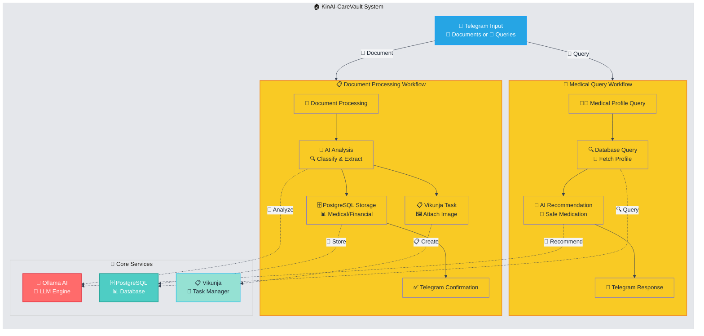
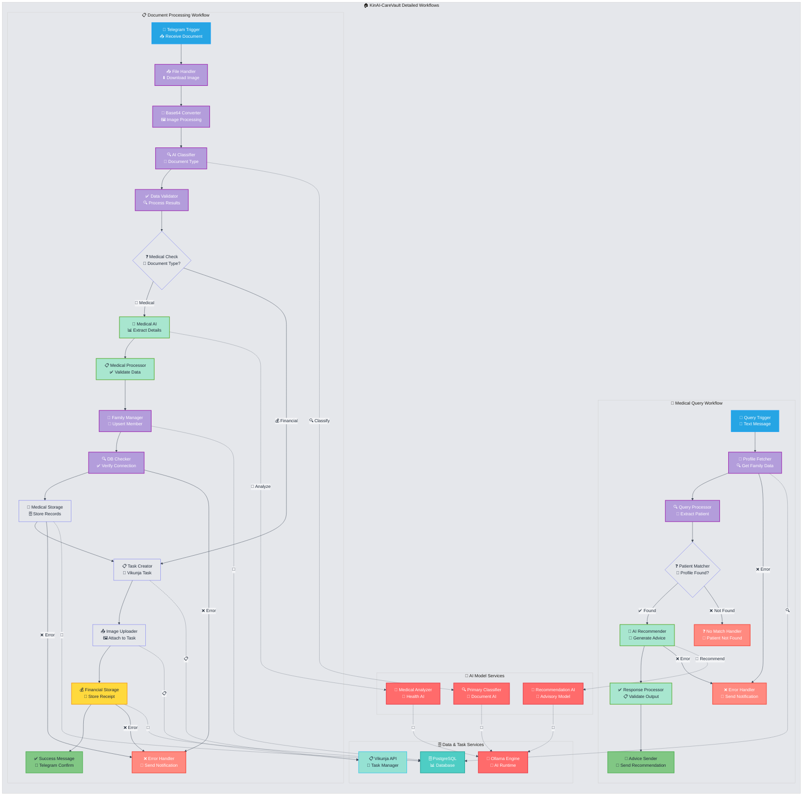

# 🧬 KinAI-CareVault

> *Your Family's AI-Powered Health & Financial Guardian* 🛡️

[](https://github.com/Logulokesh/KinAI-CareVault)
[](https://docs.docker.com/compose/)
[](https://core.telegram.org/bots)

---

## 🌟 What is KinAI-CareVault?

KinAI-CareVault is an **intelligent family health & finance management system** that transforms how you handle medical documents, prescriptions, and financial records. Simply snap a photo via Telegram, and watch AI magic happen! 📸✨

### 🎯 Core Philosophy
- 🏠 **Family-First**: Centralized profiles for every family member
- 🤖 **AI-Driven**: Smart document classification and medical recommendations  
- 🔒 **Privacy-Focused**: Your data stays in your control
- 📱 **Telegram-Native**: No apps to download, just chat naturally

---

## ⚡ Key Features

### 📄 **Smart Document Processing**
> *Upload once, organize forever*

🔍 **Auto-Classification**: Receipts, prescriptions, lab reports - AI knows the difference  
💾 **Structured Storage**: PostgreSQL database with medical + financial separation  
📋 **Task Creation**: Auto-generates Vikunja tasks with attached images  
✅ **Instant Confirmation**: Telegram notifications with extracted details  

### 👨‍👩‍👧‍👦 **Family Health Profiles**
> *Complete medical history at your fingertips*

🏥 **Medical Conditions**: Track ongoing health issues per family member  
💊 **Current Medications**: Prescription management with dosage tracking  
🚨 **Allergy Management**: Safety-first medication recommendations  
📊 **Health Analytics**: Query patterns and medical summaries  

### 🧠 **AI-Powered Medication Assistant**
> *Safe recommendations, always*

🔬 **Smart Analysis**: Considers allergies, conditions, and current meds  
⚕️ **Dosage Guidance**: Age-appropriate recommendations with precautions  
🚑 **Emergency Protocols**: When to seek immediate medical attention  
👨‍⚕️ **Doctor Consultation**: Clear advice on when professional help is needed  

### 💰 **Financial Document Tracking**
> *Every receipt, every expense, organized*

🛒 **Vendor Recognition**: Auto-extracts store names and amounts  
📈 **Spending Analytics**: Built-in SQL queries for financial insights  
🗂️ **Category Management**: Smart tagging for groceries, medical, utilities  
💳 **Receipt Archive**: Never lose another important document  

---

## 🚀 Installation Guide (with Docker Compose)

### 1️⃣ Clone Repository
```bash
git clone https://github.com/Logulokesh/KinAI-CareVault.git
cd KinAI-CareVault
```

### 2️⃣ Prepare Document Schema
Ensure your schema file (`document_processing_schema.txt`) is present in the project root. This file will be applied automatically to PostgreSQL during container startup.

### 3️⃣ Start the System with Docker Compose
```bash
docker-compose up -d
```

This will launch:
- 🗄️ **PostgreSQL** (with medical + financial schema)
- ⚙️ **n8n** (workflow automation)  
- 📝 **Vikunja API + Frontend** (task manager)

### 4️⃣ Access Services
- 🔧 **n8n Workflow Editor**: http://localhost:5678
  - Username: `admin`
  - Password: `adminpass`
- 📋 **Vikunja Frontend**: http://localhost:3456

### 5️⃣ Import Workflows into n8n
1. Log into n8n at http://localhost:5678
2. Import workflow files:
   - `medical_enhanced_n8n_workflow (2).json`
   - `fixed_n8n_workflow.json`
3. Configure environment credentials under each node:
   - 📱 **Telegram Bot API**
   - 🗄️ **PostgreSQL DB connection**
   - 📝 **Vikunja API URL & token**
   - 🧠 **Ollama AI endpoint** (if using)

### 6️⃣ Vikunja Setup
- Login and create projects corresponding to categories (as per `categoryProjectMap`)
- Set up user, labels, and tokens via Vikunja UI or API
- Use API token in your n8n workflow for authenticated task creation

### 7️⃣ Test Your Setup
- 📤 Send a test document to your Telegram bot
- 🔍 Check n8n execution logs
- ✅ Verify:
  - Data saved in PostgreSQL
  - Task created in Vikunja  
  - Telegram confirmation received

---

## 🏗️ System Architecture

### 🔄 **High-Level System Overview**
*Main flows and interactions between core components*



### 🔧 **Detailed Workflow Architecture**
*Node-by-node flow of n8n workflows with error handling*



### 🏢 **Technology Stack**
- 🤖 **AI Engine**: Ollama (Local LLM)
- 🗄️ **Database**: PostgreSQL with optimized schema
- ⚙️ **Automation**: n8n workflow platform
- 📋 **Task Management**: Vikunja with image attachments
- 📱 **Interface**: Telegram Bot API
- 🐳 **Deployment**: Docker Compose

---

## 💬 Usage Examples

### 📤 **Upload a Medical Document**
```
👤 User: [Sends prescription image via Telegram]
🤖 Bot: ✅ Prescription processed for Sarah!
       💊 Medication: Amoxicillin 500mg
       📅 Duration: 7 days, twice daily
       👨‍⚕️ Prescribed by: Dr. Smith
       📋 Task created in Vikunja Medical project
```

### 🩺 **Get Medication Advice**
```
👤 User: "What medication for Sarah's fever?"
🤖 Bot: 🌡️ For Sarah's fever, considering her profile:
       
       ✅ SAFE OPTIONS:
       • Paracetamol: 250mg every 6 hours
       • Ibuprofen: 200mg every 8 hours
       
       ⚠️ AVOID: Aspirin (age under 16)
       🚨 SEEK DOCTOR IF: Fever >39°C or persists >3 days
```

### 🧾 **Financial Document Processing**
```
👤 User: [Sends grocery receipt image]
🤖 Bot: 🛒 Receipt processed!
       🏪 Store: SuperMart
       💰 Amount: $45.67
       📋 Task created in Groceries project
       🗂️ Stored in financial records
```

---

## 📊 Database Schema Highlights

### 👨‍👩‍👧‍👦 **Family Management**
```sql
family_members: Telegram-linked family profiles
medical_conditions: Ongoing health conditions per member  
current_medications: Active prescriptions with dosages
allergies: Safety-critical allergy information
```

### 🏥 **Medical Records**
```sql
medical_records: Lab reports, prescriptions, diagnoses
- Linked to family members via foreign keys
- Timestamped with creation/update tracking
- Document type classification for easy querying
```

### 💳 **Financial Tracking**
```sql
financial_records: Receipts, bills, expense tracking
- Vendor recognition and amount extraction
- Category-based organization
- Date-based filtering for analytics
```

---

## 🔒 Privacy & Security

### 🛡️ **Data Protection**
- 🏠 **Self-Hosted**: Your data never leaves your infrastructure
- 🔐 **Encrypted Storage**: PostgreSQL with proper access controls
- 🔑 **Secure APIs**: Token-based authentication for all services
- 📱 **Telegram Security**: End-to-end encrypted file transfers

### ⚠️ **Medical Disclaimer**
- 🩺 AI recommendations are **not medical advice**
- 👨‍⚕️ Always consult healthcare professionals for serious conditions
- 🚨 System provides **guidance only**, not diagnosis
- 📋 Maintain regular doctor visits and professional care

---

## 🤝 Contributing

We welcome contributions! Here's how to get involved:

### 🔧 **Development Setup**
1. 🍴 Fork the repository
2. 🌿 Create feature branch: `git checkout -b feature/amazing-feature`
3. 💻 Make your changes with proper testing
4. 📝 Commit: `git commit -m 'Add amazing feature'`
5. 🚀 Push: `git push origin feature/amazing-feature`
6. 🔀 Open a Pull Request

### 🎯 **Areas for Contribution**
- 🧠 **AI Model Improvements**: Better document classification
- 🎨 **UI/UX Enhancements**: Telegram bot interactions
- 🔍 **Analytics Features**: Health trend analysis
- 🌐 **Internationalization**: Multi-language support
- 📱 **Mobile App**: Native companion apps

---

## 📜 License

This project is licensed under the **MIT License** - see the [LICENSE](LICENSE) file for details.

---

## 📞 Support & Community

### 🆘 **Getting Help**
- 📖 **Documentation**: Check this README and inline comments
- 🐛 **Bug Reports**: [Open an issue](https://github.com/Logulokesh/KinAI-CareVault/issues)
- 💡 **Feature Requests**: We'd love to hear your ideas!
- 💬 **Discussions**: Join our community conversations

### 📧 **Contact**
- 🐙 **GitHub**: [@Logulokesh](https://github.com/Logulokesh)
- 📧 **Email**: [your-email@example.com](mailto:your-email@example.com)
- 🌐 **Project**: [KinAI-CareVault](https://github.com/Logulokesh/KinAI-CareVault)

---

<div align="center">

### 🚀 Ready to revolutionize your family's health management?

**[⭐ Star this repo](https://github.com/Logulokesh/KinAI-CareVault)** • **[🍴 Fork & Contribute](https://github.com/Logulokesh/KinAI-CareVault/fork)** • **[📖 Read the Docs](https://github.com/Logulokesh/KinAI-CareVault/wiki)**

*Built with ❤️ by the KinAI-CareVault community*

</div>
